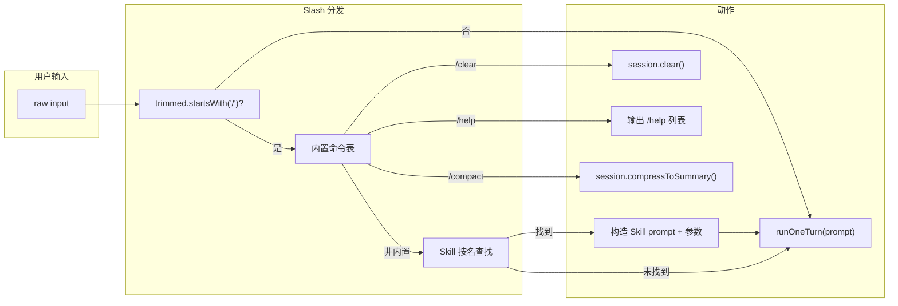

# Claude Code Slash Command 调研与 Code Agent 落地方案

## 一、Claude Code 中 Slash Command 能做什么

Claude Code 的 Slash Command 分为三类：**内置命令**、**捆绑 Skill**、**自定义 Skill**。用户输入以 `/` 开头时触发对应逻辑。

### 1. 内置命令（Built-in Commands）

在交互模式下直接执行固定逻辑，不经过模型：

| 命令                                 | 作用                                     |
| ---------------------------------- | -------------------------------------- |
| `/clear`                           | 清空对话历史，保留设置与项目结构，用于控制成本、切换任务           |
| `/compact`                         | 压缩对话：将较早消息摘要后保留，减少 token               |
| `/help`                            | 列出所有可用命令                               |
| `/debug [description]`             | 排查当前会话问题，可读 session debug log，可选描述聚焦分析 |
| `/config`、`/model`、`/output-style` | 管理设置、切换模型、输出风格                         |
| `/cost`                            | 显示 token 使用与成本统计                       |
| `/context`                         | 可视化当前上下文使用情况                           |
| `/exit`、`/quit`                    | 退出 Claude Code                         |
| `/status`                          | 显示当前会话状态                               |

### 2. 捆绑 Skill（Bundled Skills）

随 Claude Code 提供，以 **prompt + 工具** 驱动模型完成复杂任务：

| 命令            | 作用                                                                        |
| ------------- | ------------------------------------------------------------------------- |
| `/claude-api` | 按项目语言加载 Claude API 参考（Python/TS/Java/Go 等）与 Agent SDK 参考                  |
| `/batch`      | 大规模代码库变更：分解为 5–30 个并行单元，用 git worktree 起多个后台 agent，各自实现、跑测、开 PR           |
| `/simplify`   | 审查最近修改的文件（复用、质量、效率），可起三个并行 review agent，汇总后自动修复；可加参数聚焦（如 focus on memory） |

### 3. 自定义 Skill（Custom Skills）

- **位置**：`.claude/skills/<name>/SKILL.md`（项目/个人/企业/插件）。
- **调用**：`/skill-name` 或 `/skill-name arg1 arg2`；与旧版 `.claude/commands/` 行为一致，Skill 优先。
- **Frontmatter**：`name`、`description`、`disable-model-invocation`、`user-invocable`、`allowed-tools`、`context: fork`、`agent`、`argument-hint`、`hooks` 等。
- **参数**：内容中可用 `$ARGUMENTS`、`$ARGUMENTS[N]`、`$N`、`${CLAUDE_SESSION_ID}`、`${CLAUDE_SKILL_DIR}`。
- **高级**：动态上下文注入（`!`command`` 先执行再替换）、`context: fork` 在子 agent 中执行、限制工具 `allowed-tools`。

当前项目已有 **Skill 加载**（[packages/cli/src/skills/load.ts](packages/cli/src/skills/load.ts)）：从 `skillPaths`、插件、全局目录加载 SKILL.md，全部拼进 system prompt（[build-system-prompt.ts](packages/cli/src/skills/build-system-prompt.ts)），**没有**「按名称选择并注入单条 Skill 再调模型」的机制。

---

## 二、当前 Code Agent 与 Slash 的差距

- **REPL/TUI 输入**：用户输入直接作为 `prompt` 传给 `runOneTurn`（[index.ts 577–585](packages/cli/src/index.ts)、[App.tsx handleSubmit](packages/cli/src/tui/App.tsx)），未识别以 `/` 开头的命令。
- **Session**：[AgentSession](packages/cli/src/agent/session.ts) 有 `getMessages()`、`compressToSummary()`，无 `clear()` 等会话级操作。
- **Skills**：仅「全量注入 system」，无「按名调用单 Skill + 可选参数」的 Slash 语义。

---

## 三、建议在 Code Agent 中落地的 Slash 能力

### 优先落地（高价值、实现成本可控）

1. `**/clear`**
  - 行为：清空当前会话消息列表，保留配置与 skill 等；下一轮从干净上下文开始。  
  - 实现：在 `AgentSession` 增加 `clear()`（或等价重置 messages），在 REPL/TUI 中若输入为 `/clear` 则先调用 `session.clear()` 再提示已清空，不调用 `runOneTurn`。
2. `**/help`**
  - 行为：列出当前可用的 Slash 命令与简短说明（内置 + 已加载的 Skill 名及 description）。  
  - 实现：维护一份内置命令列表（含 name + 一行 description）；从已加载的 `SkillEntry[]` 中取 name（或从 SKILL frontmatter 解析）/description，拼成帮助文本；输入为 `/help` 时直接输出该文本，不调用模型。
3. `**/compact`**
  - 行为：与现有「上下文压缩」对齐：当消息数超过阈值时，将较早消息摘要为一条保留，其余逻辑与现有 `compressToSummary` 一致。  
  - 实现：输入为 `/compact` 时，直接调用 `session.compressToSummary(...)`（使用当前 policy 的 threshold/keepRecent 等），可选输出一行 “Context compacted.”，不调用模型。
4. **Skill 按名调用（`/skill-name [args]`）**
  - 行为：若输入匹配 `/[\w-]+`（且非内置命令），则在当轮只把「该 Skill 的 content + 参数替换（$ARGUMENTS、$0…）」作为用户消息（或 system 追加 + 一条简短 user 消息）交给 `runOneTurn`，而不是把所有 skills 都塞进 system。  
  - 实现：  
    - 在解析用户输入时，若以 `/` 开头且不是内置命令，则解析出 `name` 和 `args[]`。  
    - 在已加载的 `SkillEntry[]` 中按 name 查找（需在 load 时解析 frontmatter 的 `name`，缺省用目录名）；若找到，将 body 中 `$ARGUMENTS`、`$N` 替换后，作为该轮「用户消息」或「system 后缀 + 简短 user 消息」传入 loop。  
    - 可选：仅当该 skill 被调用时，在当轮 system 中注入该 skill 内容，避免每次都带全量 skills（可后续再做）。

### 可选 / 后续

1. `**/cost`**（或 `/context`）
  - 若有 token 统计：在输入为 `/cost` 时输出当前会话的估算 token 或调用次数；无则仅输出 “Token/cost tracking not available.”。
2. `**/debug`**
  - 将当前会话最近几条消息或 transcript 摘要写入临时文件，并生成一句 “Debug info written to …”，便于用户提供上下文给支持。
3. `**/exit`**
  - 与当前 TUI/REPL 的「空行退出」或 Ctrl+C 行为统一即可，可选显式支持 `/exit` 便于文档一致。

---

## 四、实现要点（不写代码，仅方案）

- **入口统一**：在 REPL 循环和 TUI `handleSubmit` 中，在调用 `runOneTurn` 之前先判断 `trimmed.startsWith("/")`：若是，则走 Slash 分支（内置命令或 Skill 解析），否则照旧 `runOneTurn(trimmed, ...)`。  
- **内置命令表**：在 cli 或单独模块中维护 `BUILTIN_COMMANDS: { name, description, handler }`，便于 `/help` 和扩展。  
- **Session.clear()**：在 [AgentSession](packages/cli/src/agent/session.ts) 增加 `clear(): void`，将 `this.messages.length = 0`（或重置为 `[]`）。  
- **Skill 名解析**：在 [load.ts](packages/cli/src/skills/load.ts) 的 `parseSkillMd` 中解析 frontmatter 的 `name`（以及 `description`），在 `SkillEntry` 中保留 `name`；若未提供 `name`，用目录名或文件名。这样在 index/TUI 层可根据 `name` 匹配 `/skill-name`。  
- **参数替换**：对 Skill body 做 `$ARGUMENTS` → `args.join(" ")`，`$0`、`$1`… → `args[0]`、`args[1]`… 的替换后再作为该轮 prompt。  
- **TUI/REPL 一致**：两处共用同一套 Slash 解析与执行逻辑（可抽到 `handleSlashCommand(input, context) => { handled: boolean; message?: string }` 或返回「要发给 runOneTurn 的 prompt」或「已处理无需 runOneTurn」）。

---

## 五、架构关系简图

---

## 六、总结

- **Claude Code Slash 能做的事**：内置命令（清空、压缩、帮助、配置、成本/上下文、退出等）、捆绑 Skill（batch/simplify/claude-api）、自定义 Skill（按名调用、参数、子 agent、动态上下文）。  
- **建议优先在 code agent 中落地**：`/clear`、`/help`、`/compact` 以及 **Skill 按名调用**（`/skill-name [args]`）；可选后续增加 `/cost`、`/debug`、`/exit`。  
- **实现要点**：统一在 REPL/TUI 入口做 Slash 判断与分发、为 Session 增加 `clear()`、Skill 加载时保留 `name` 并支持参数替换、内置命令表集中维护便于扩展与 `/help`。

