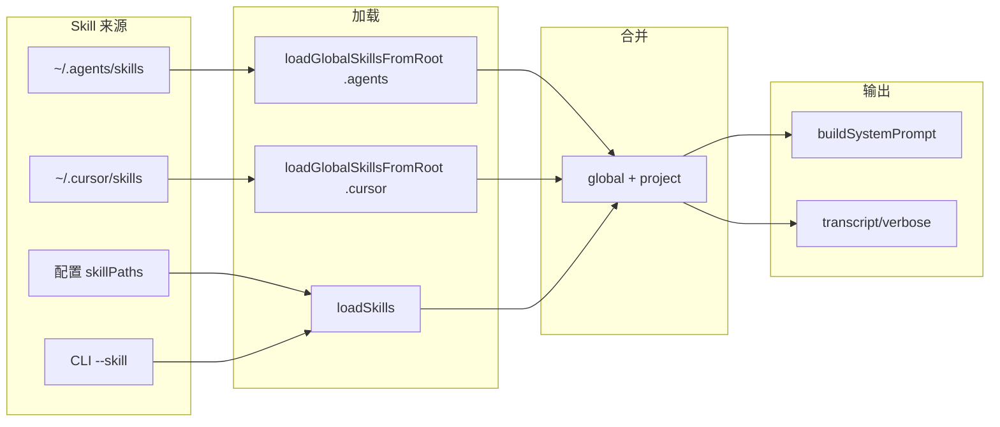

# 全局 Skills 能力优化：调研与集成方案（最新）

## 一、全局 Skills 概念梳理

### 1.1 定义与来源

在本仓库中**未**出现 “global skills” 一词；概念来自 **Cursor 官方约定**与 **Agents 技能目录**（如 `~/.agents/skills`）：


| 类型                            | 路径                               | 作用域          |
| ----------------------------- | -------------------------------- | ------------ |
| **Personal / Global（Agents）** | `~/.agents/skills/<skill-name>/` | 对所有项目生效      |
| **Personal / Global（Cursor）** | `~/.cursor/skills/<skill-name>/` | 对所有项目生效      |
| **Project**                   | `.cursor/skills/<skill-name>/`   | 仅当前仓库，可随仓库共享 |


- **全局 Skills** = 用户主目录下多处技能根目录，每处下面每个**子目录**代表一个 skill，目录内包含 `SKILL.md` 或 `skill.json`。mini-agent 需同时支持：
  - `**~/.agents/skills/`**：例如 `~/.agents/skills/git-commit/SKILL.md`
  - `**~/.cursor/skills/`**：Cursor 约定
- **注意**：`~/.cursor/skills-cursor/` 为 Cursor 内置技能目录，**不应**被 mini-agent 当作用户全局 Skills 使用。

### 1.2 目录结构约定（两处结构一致）

```
~/.agents/skills/          # 或 ~/.cursor/skills/
├── git-commit/            # 一个 skill
│   └── SKILL.md
├── frontend-code-review/
│   └── SKILL.md
└── my-custom-skill/
    └── skill.json
```

- 每个 skill 一个**子目录**，目录内为单文件 `SKILL.md` 或 `skill.json`（与现有 [load.ts](packages/cli/src/skills/load.ts) 解析格式一致）。

### 1.3 当前 CLI 与全局的差异


| 维度     | 当前 CLI（Phase 9）                           | 全局 Skills（待支持）                                       |
| ------ | ----------------------------------------- | ---------------------------------------------------- |
| 路径来源   | 仅 `skillPaths`（配置）+ `--skill`（CLI），相对 cwd | 固定/可配置的用户目录：默认 `~/.agents/skills`、`~/.cursor/skills` |
| 解析基准   | 所有路径相对 `process.cwd()`                    | 相对 `os.homedir()` 的多个固定子目录                           |
| 目录语义   | 单层目录内直接放 `SKILL.md` / `skill.json`        | **子目录**代表一个 skill，其内再放 `SKILL.md` 或 `skill.json`     |
| 是否默认加载 | 否，需显式配置或传参                                | 是（可配置关闭）                                             |


当前 [load.ts](packages/cli/src/skills/load.ts) 的 `loadFromDir` 只扫描**给定目录下直接子文件** `SKILL.md` / `skill.json`，**不会**扫描“子目录内再有一层 SKILL.md”。因此对 `~/.agents/skills`、`~/.cursor/skills` 等全局根需要单独一套「按子目录发现 skill」的逻辑。

---

## 二、全局 Skills 用法梳理（目标行为）

### 2.1 加载顺序与优先级（建议）

合并顺序保持「先全局、再项目、再会话」，便于项目或单次运行覆盖全局：

```
最终 system prompt = BASE + [Global Skills] + [Project/Config Skills] + [CLI --skill]
```

- **Global**：来自多个全局根目录（默认 `~/.agents/skills`、`~/.cursor/skills`，顺序：先 .agents 后 .cursor）；每个根目录下按子目录发现 skill，同一子目录名在不同根下出现时，后加载的覆盖先前的。
- **Project/Config**：来自 `mini-agent.config.json` 的 `skillPaths`（相对 cwd）。
- **CLI**：来自 `--skill` 传入的路径（相对 cwd），追加在 config 之后（与 [09-phase9-runbook.md](docs/ai/09-phase9-runbook.md) 一致）。

同一条 skill 若在多处出现，后加载的覆盖先前的（按上述顺序，后写优先）。

### 2.2 可观测性（与 Phase 9 一致）

- **Transcript**：`skillsLoaded` 中每条保留 `path` 与 `charCount`；全局 skill 的 path 建议带来源前缀，例如 `agents:git-commit`、`cursor:git-commit` 或完整路径 `~/.agents/skills/git-commit/SKILL.md`，便于区分来自哪一全局根。
- **--verbose**：已加载的 skill 列表（含全局）在 stderr 打印。
- **--dry-run**：已加载的 skill 摘要（含全局）在 stderr 打印。

### 2.3 配置与开关

- **默认**：依次从 `~/.agents/skills`、`~/.cursor/skills` 两个根目录加载；每个根若存在则扫描其下子目录，子目录内加载 `SKILL.md` 或 `skill.json`。某根不存在或为空则跳过，两个都无则与当前行为一致。
- **覆盖路径**：通过配置项 `globalSkillDirs?: string[]`（数组）覆盖默认两个根；若提供则**完全替换**默认列表（如只填 `["~/.agents/skills"]` 则只读 .agents）。环境变量可用 `GLOBAL_SKILLS_DIRS` 逗号分隔多个路径（可选，与 config 合并顺序见下）。
- **关闭全局**：配置项 `skipGlobalSkills: true` 或环境变量 `MINI_AGENT_SKIP_GLOBAL_SKILLS=1`，则不再从任何全局目录加载，仅保留 project + CLI。

---

## 三、实现要点（与现有代码的衔接）

### 3.1 目录发现与加载

- **位置**：在 [packages/cli/src/skills/load.ts](packages/cli/src/skills/load.ts) 中新增：
  - `**loadGlobalSkillsFromRoot(rootDir: string, pathPrefix: string): Promise<SkillEntry[]>`**  
  对单个根目录 `rootDir` 做 `readdir`，仅处理**子目录**；对每个子目录内查找 `SKILL.md` 或 `skill.json`，用现有 `loadOneFile` + 解析逻辑，返回 `SkillEntry[]`。  
  `path` 使用 `pathPrefix` + 子目录名，例如 `agents:git-commit`、`cursor:frontend-code-review`，便于 transcript 区分来源。
  - `**loadAllGlobalSkills(globalSkillDirs: string[]): Promise<SkillEntry[]>`**  
  依次对 `globalSkillDirs` 中每个已解析的绝对路径调用 `loadGlobalSkillsFromRoot`，将结果按顺序合并（同名校验可选：后加载覆盖先加载可按 path 去重或保留全部，建议保留全部并在 system prompt 中按顺序注入）。
- **解析**：复用现有 `parseSkillMd`、`parseSkillJson`、`loadOneFile`，不改变 Phase 9 的格式约定。

### 3.2 解析 ~ 与默认路径

- 使用 `os.homedir()` 解析 `~`，保证跨平台。
- 默认全局根目录列表：`[join(homedir, '.agents', 'skills'), join(homedir, '.cursor', 'skills')]`。若配置或环境变量提供 `globalSkillDirs`，则用其**完全替换**该默认列表（每项需解析 `~`）。

### 3.3 配置与解析

- **ConfigFile / ResolvedConfig**（[config.ts](packages/cli/src/config.ts)）：
  - 新增可选 `globalSkillDirs?: string[]`、`skipGlobalSkills?: boolean`。
  - 环境变量：`GLOBAL_SKILLS_DIRS` 为逗号分隔的路径列表（可选），与 config 合并时 env 覆盖 config；`MINI_AGENT_SKIP_GLOBAL_SKILLS` 为 truthy 时视同 `skipGlobalSkills: true`。
  - 合并顺序：default（两个根）→ config file `globalSkillDirs` → env `GLOBAL_SKILLS_DIRS`；若某层提供了 `globalSkillDirs`，则替换而非追加，保证行为可预测。

### 3.4 入口合并逻辑（index.ts）

- 在 [packages/cli/src/index.ts](packages/cli/src/index.ts) 中，在现有「仅从 `resolved.skillPaths` 加载」之前或之后：
  1. 若未 `skipGlobalSkills`，则解析 `globalSkillDirs`（默认 `[~/.agents/skills, ~/.cursor/skills]`，或来自 config/env），调用 `loadAllGlobalSkills(globalSkillDirs)`，得到 `globalEntries`。
  2. 若 `resolved.skillPaths` 非空，则 `loadSkills(resolved.skillPaths, cwd)` 得到 `projectEntries`。
  3. 合并：`allEntries = [...globalEntries, ...projectEntries]`（全局在前）。
  4. 若 `allEntries.length > 0`，则 `resolved.systemPrompt = buildSystemPrompt(allEntries, SYSTEM_PROMPT)`，并将 `skillsLoaded` 设为 `allEntries` 的 `path` + `charCount`（含全局与项目），供 transcript / verbose / dry-run 使用。

这样 code agent 会在每次 run 中自动应用用户全局 Skills（含 `~/.agents/skills` 与 `~/.cursor/skills`），并保持与 Phase 9 的 transcript、verbose、dry-run 行为一致。

### 3.5 向后兼容与边界

- 两个默认全局根都不存在或均为空：不加载任何全局 skill，行为与当前完全一致。
- `skipGlobalSkills` 为 true（或对应 env）：不调用全局加载，仅保留 project + CLI，与「仅项目 skill」行为一致。
- 全局根目录下非目录的条目（文件、软链等）：忽略，仅遍历子目录且子目录内仅认 `SKILL.md` / `skill.json`，与现有 load 行为一致。

---

## 四、文档与验收

- **Runbook**：在 [docs/ai/09-phase9-runbook.md](docs/ai/09-phase9-runbook.md) 中新增「全局 Skills」小节：说明默认两处路径（`~/.agents/skills`、`~/.cursor/skills`）、合并顺序、`globalSkillDirs` / `skipGlobalSkills` 及环境变量、transcript 中 `path` 的 `agents:`* / `cursor:`* 含义；并补充验证命令（如 `~/.agents/skills/git-commit/SKILL.md` 存在时启用 verbose 查看是否被加载）。
- **验收标准**：
  - 在 `~/.agents/skills/git-commit/` 下放置 `SKILL.md`（或 `~/.cursor/skills/` 下），不传 `--skill`、不配 `skillPaths`，运行后 transcript 中 `skillsLoaded` 含该全局 skill（path 带 `agents:` 或 `cursor:` 前缀），且 system 行为体现其内容。
  - 设置 `skipGlobalSkills: true` 或 `MINI_AGENT_SKIP_GLOBAL_SKILLS=1` 后，不再加载任何全局目录，行为与当前无全局时一致。
  - 同时使用全局 + `skillPaths` 或 `--skill` 时，合并顺序为 global（.agents → .cursor）→ config → CLI，且 transcript/verbose 中能区分来源。
  - 现有 Phase 9 用例（仅 project/CLI skill、无全局）无回归；`pnpm -r build`、`pnpm -r typecheck` 通过。

---

## 五、流程概览




---

## 六、建议实施顺序

1. **Config**：在 `config.ts` 中增加 `globalSkillDirs`（默认 `[~/.agents/skills, ~/.cursor/skills]`）、`skipGlobalSkills` 及环境变量 `GLOBAL_SKILLS_DIRS`、`MINI_AGENT_SKIP_GLOBAL_SKILLS` 解析，并在 `loadConfig` 中合并进 `ResolvedConfig`。
2. **Load**：在 `load.ts` 中实现 `loadGlobalSkillsFromRoot(rootDir, pathPrefix)` 与 `loadAllGlobalSkills(globalSkillDirs)`（按子目录发现 + 复用现有解析），path 使用前缀如 `agents:git-commit`、`cursor:git-commit`。
3. **Entry**：在 `index.ts` 中合并全局与 project 的 skill 列表，再调用 `buildSystemPrompt` 与现有 transcript/verbose/dry-run 逻辑。
4. **文档与验收**：更新 runbook（含 `~/.agents/skills` 与 `~/.cursor/skills`）、补充验收用例并执行 DoD。

