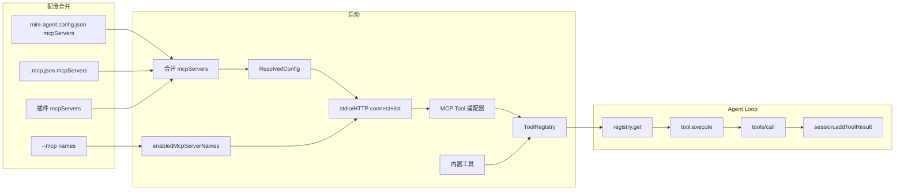

# Phase 11：MCP 客户端 实施计划

## 目标

CLI 作为 MCP **客户端**，能够连接到一个或多个 MCP 服务器（**stdio** 与 **HTTP** 传输），获取其暴露的 tools 并注入当前 Agent Loop。配置格式与 [Claude Code MCP](https://code.claude.com/docs/en/mcp) 及社区常用 `.mcp.json` 兼容，便于复用现有配置与插件生态。未配置或未指定 MCP 时行为与当前一致。

## 社区生态兼容原则

- **配置形态**：支持与 Claude Code 一致的 `mcpServers` 结构（stdio：`command`/`args`/`env`；HTTP：`type: "http"`, `url`, `headers?`），并支持**项目级 `.mcp.json`**（cwd 根目录），使同一份配置可在不同工具间复用。
- **传输**：至少支持 **stdio**（本地进程）与 **HTTP**（远程服务，社区推荐）；SSE 已由 Claude 文档标为 deprecated，优先 HTTP。
- **插件**：支持从已加载插件的 `.mcp.json` 或 `plugin.json` 的 `mcpServers` 合并配置，与 Phase 10 插件机制衔接；插件内路径可使用占位符（如 `${PLUGIN_ROOT}`）在加载时展开。
- **环境变量**：在配置值中支持 `${VAR}` 与 `${VAR:-default}` 展开（command、args、env、url、headers），与 Claude Code 行为一致。

## 现状分析


| 模块   | 当前状态                                                                                                                                                                             | 本 Phase 变更                                                                                                                               |
| ---- | -------------------------------------------------------------------------------------------------------------------------------------------------------------------------------- | ---------------------------------------------------------------------------------------------------------------------------------------- |
| 配置   | `ConfigFile`/`ResolvedConfig` 无 MCP 相关字段                                                                                                                                         | 新增 `mcpServers`（stdio + HTTP 联合类型）、支持项目 `.mcp.json` 与插件 mcpServers 合并；`enabledMcpServerNames`；CLI `--mcp <name>`。                        |
| 工具系统 | [packages/cli/src/tools/registry.ts](packages/cli/src/tools/registry.ts) 仅注册内置 Tool，[loop.ts](packages/cli/src/agent/loop.ts) 通过 `registry.get(name)` 取工具并 `tool.execute(input)` | 在构建 registry 时增加「MCP 适配器」Tool 的注册，命名前缀 `mcp_<server>_<tool>`，execute 内转发 MCP `tools/call`。                                               |
| 入口   | [packages/cli/src/index.ts](packages/cli/src/index.ts) 在 loadConfig 后建 registry、注册 4 个内置工具、再 createProvider(registry.list())                                                     | 在注册内置工具后，若配置了 MCP，则连接 MCP server(s)、拉取 tools/list、为每个 MCP tool 注册 adapter；dry-run/verbose 输出 MCP 信息；writeTranscript 写入 mcpServersLoaded。 |
| 可观测性 | transcript 有 skillsLoaded、pluginsLoaded                                                                                                                                          | 新增 `mcpServersLoaded?: { name: string; tools: string[] }[]`；verbose 打印已连接 MCP 及工具列表。                                                     |


## 实现要点

### 1. 类型与配置（对齐 Claude Code / .mcp.json）

- **McpServerConfig 联合类型**（与 [Claude Code 文档](https://code.claude.com/docs/en/mcp) 及社区 `.mcp.json` 一致）：
  - **Stdio**：`{ type?: "stdio"; command: string; args?: string[]; env?: Record<string, string> }`。无 `type` 时，若存在 `command` 则视为 stdio。
  - **HTTP**：`{ type: "http"; url: string; headers?: Record<string, string> }`。可选后续扩展 `oauth`。
- **ConfigFile**：增加 `mcpServers?: Record<string, McpServerConfig>`；解析时做 env 展开（见下）。
- **项目级 .mcp.json**：在 cwd 下读取 `.mcp.json`（若存在），解析其 `mcpServers` 与 `mini-agent.config.json` 中的 `mcpServers` 合并（建议：项目 .mcp.json 与 config 的 key 冲突时，项目 .mcp.json 优先或按实现约定合并），便于用户仅维护一份与 Claude Code 共用的配置。
- **环境变量展开**：对 `command`、`args` 每项、`env` 的 key/value、`url`、`headers` 的 value 支持 `${VAR}` 与 `${VAR:-default}`；未设置且无默认则报错或跳过该 server（由实现决定）。
- **ResolvedConfig**：增加合并后的 `mcpServers` 与 **enabledMcpServerNames**：CLI `--mcp name1 name2` 时只启用这些；未传则启用全部已配置 key。
- **loadConfig**：合并顺序建议为「默认无 MCP → 配置文件 mcpServers → 项目 .mcp.json 的 mcpServers（按 key 合并/覆盖）→ 插件 mcpServers（见下）」，再根据 CLI `--mcp` 过滤出 enabledMcpServerNames。

### 2. 插件 MCP 配置（与 Phase 10 衔接）

- **来源**：已通过 `discoverPlugins` 加载的插件，若插件根目录存在 `.mcp.json` 或 `plugin.json` 内包含 `mcpServers`，则解析并合并到全局 `mcpServers`。
- **命名**：插件提供的 server 可使用前缀或命名空间避免冲突（例如 `plugin-name__server-name`），或直接合并、同名时插件覆盖（由实现选择并文档化）。
- **占位符**：插件内路径支持 `${PLUGIN_ROOT}` 或与 Claude 一致的 `${CLAUDE_PLUGIN_ROOT}`，在解析时替换为插件根目录绝对路径。
- **生命周期**：仅当该次 run 已启用该插件（已加载其 skills）时，其 mcpServers 才参与合并；不单独为 MCP 加载插件。

### 3. MCP 客户端封装与适配器

- **依赖**：引入 `@modelcontextprotocol/sdk`（`Client`、`ListToolsResultSchema`、`CallToolResultSchema`），使用 **StdioClientTransport**（stdio）及 SDK 提供的 **HTTP/Streamable HTTP** transport（若有）连接远程 MCP；参考 [MCP 官方教程](https://modelcontextprotocol.io/tutorials/building-a-client-node) 与 SDK 文档。
- **薄封装层**（新模块 `packages/cli/src/mcp/`）：
  - **connectAndListTools(serverName, config)**：根据 config 的 `type` 或是否含 `command` 选择 stdio 或 HTTP transport，创建 Client 并 connect，请求 `tools/list`，返回 `{ client, tools }`（或等价）。连接失败时抛出或返回错误，由上层决定 fail-fast 或跳过该 server。
  - **Tool 适配器**（转为 [Tool](packages/cli/src/tools/types.ts)）：  
    - `name`: `mcp_<serverName>_<tool.name>`（tool.name 中非字母数字可替换为 `_`）。  
    - `description` / `inputSchema`: 来自 MCP tool，inputSchema 映射为现有 `ToolInputSchema`。  
    - `execute(args)`: 调用 client `request({ method: "tools/call", params: { name: 原始 tool.name, arguments: args } }, CallToolResultSchema)`，将返回 content 转为字符串，错误时返回 `Tool error: ...`。
- **生命周期**：在 index 构建 registry 阶段连接 MCP；连接成功后持有 Client 引用，该 run（或 REPL）内复用；进程退出前可调用 SDK 的 close 做优雅关闭。

### 4. 与 Agent Loop 集成

- **无需改 loop 逻辑**：MCP 以适配器 Tool 注册到 `ToolRegistry`，loop 仍 `registry.get` + `tool.execute(input)`；超时与错误格式与现有工具一致。
- **超时**：使用 `resolved.policy.toolTimeoutMs` 包装 MCP 的 request 或 adapter execute。
- **批准流**：MCP 适配器默认 `requiresApproval: false`；后续可按名称或配置扩展需批准的 MCP 工具。

### 3. 与 Agent Loop 集成

- **无需改 loop 逻辑**：MCP 工具以「适配器 Tool」身份注册到 `ToolRegistry`，与现有 `read_file`、`execute_command` 等一致；loop 仍通过 `registry.get(toolUse.name)` 得到 Tool 并调用 `execute(input)`，超时与错误格式与现有工具一致（session.addToolResult(..., content, isError)）。
- **超时**：若 MCP SDK 的 request 支持超时，使用 `resolved.policy.toolTimeoutMs`；否则在 adapter 的 execute 外包一层 Promise.race(toolTimeoutMs)，超时则返回 `Tool error: timeout`。
- **批准流**：MCP 适配器 Tool 的 `requiresApproval` 可默认 false；若需「某 MCP 工具需批准」，可在后续扩展（如按名称或配置标记）。

### 5. 配置与 CLI

- **CLI**：`--mcp <name>` 可多次使用，表示只启用这些已配置的 server；不传则启用全部已合并的 mcpServers。
- **合并顺序**：配置文件 + 项目 `.mcp.json` + 插件 mcpServers → 得到完整 `mcpServers`；CLI `--mcp` 仅做过滤（白名单）。

### 6. 可观测性

- **transcript**：在 [writeTranscript](packages/cli/src/infra/logger.ts) 的 payload 中增加可选 `mcpServersLoaded?: { name: string; tools: string[] }[]`，记录本次 run 连接的 MCP 名称及该 server 暴露的工具名列表（注册名如 `mcp_xxx_yyy`）。
- **verbose**：连接 MCP 后，若 `resolved.verbose` 为 true，stderr 输出如 `[verbose] mcp servers: name1 (toolA, toolB), name2 (toolC)`。
- **dry-run**：若有 MCP，输出将启用的 server 名及将从其注册的工具名列表。

### 7. 配置示例（与社区 .mcp.json 兼容）

项目根目录 `.mcp.json`（与 Claude Code 同格式，可复用）：

```json
{
  "mcpServers": {
    "filesystem": {
      "command": "npx",
      "args": ["-y", "@modelcontextprotocol/server-filesystem", "/path/to/allowed/dir"],
      "env": {}
    },
    "sentry": {
      "type": "http",
      "url": "https://mcp.sentry.dev/mcp",
      "headers": {}
    }
  }
}
```

`mini-agent.config.json` 内也可直接写 `mcpServers`，结构同上；支持 env 展开 `${VAR}`、`${VAR:-default}`。

## 文件变更清单（建议）


| 文件                                                                                        | 变更说明                                                                                                                                                   |
| ----------------------------------------------------------------------------------------- | ------------------------------------------------------------------------------------------------------------------------------------------------------ |
| [packages/cli/package.json](packages/cli/package.json)                                    | 增加依赖 `@modelcontextprotocol/sdk`。                                                                                                                      |
| [packages/cli/src/config.ts](packages/cli/src/config.ts)                                  | 新增 `McpServerConfig`（stdio                                                                                                                             |
| [packages/cli/src/mcp/client.ts](packages/cli/src/mcp/client.ts)（新建）                      | 按 config 选择 stdio 或 HTTP transport，封装 connect + `tools/list`，返回 client + tools。                                                                        |
| [packages/cli/src/mcp/adapter.ts](packages/cli/src/mcp/adapter.ts)（新建）                    | 将 MCP tool 转为 `Tool`（name 前缀、inputSchema 映射、execute 内调 `tools/call`），支持 toolTimeoutMs。                                                                 |
| [packages/cli/src/mcp/env-expand.ts](packages/cli/src/mcp/env-expand.ts)（新建，可选）           | 对 mcpServers 配置做 `${VAR}` / `${VAR:-default}` 展开，供 config 与插件解析共用。                                                                                     |
| [packages/cli/src/plugins/discover.ts](packages/cli/src/plugins/discover.ts) 或新建插件 MCP 合并 | 在 discover 时读取插件 `.mcp.json` 或 manifest 的 `mcpServers`，返回供上层合并；占位符 `${PLUGIN_ROOT}` 等展开。                                                               |
| [packages/cli/src/index.ts](packages/cli/src/index.ts)                                    | 解析 CLI `--mcp`；在构建 registry 后、createProvider 前：合并插件 mcpServers → 对 enabledMcpServerNames 连接并注册 adapter；dry-run/verbose/transcript 写入 mcpServersLoaded。 |
| [packages/cli/src/infra/logger.ts](packages/cli/src/infra/logger.ts)                      | `TranscriptPayload` 增加可选 `mcpServersLoaded?: { name: string; tools: string[] }[]`。                                                                     |
| [docs/ai/plan-phase-11.md](docs/ai/plan-phase-11.md)                                      | 本方案文档（Plan 步骤产出）。                                                                                                                                      |
| [docs/ai/11-phase11-runbook.md](docs/ai/11-phase11-runbook.md)                            | Phase 11 运行与验证说明（Runbook，结构符合 SOP 5.2）；含 .mcp.json 与 HTTP 示例。                                                                                          |


## 可选扩展（本 Phase 可不做）

- **SSE transport**：社区文档推荐 HTTP 替代 SSE；若 SDK 仅提供 SSE 客户端，可先实现 HTTP + stdio，SSE 留作后续。
- **OAuth / 认证**：HTTP 的 `oauth`、`headers` 中的 Bearer 等由配置传入即可；交互式 OAuth 流程可后续再做。
- **resources/read**：仅注入 tools；resources 留作后续。

## 验收标准（DoD）

- **Stdio**：在配置或项目 `.mcp.json` 中配置一个 stdio MCP server，CLI 能列出其 tools（dry-run 或 verbose），并在一次对话中成功调用至少一个 MCP tool，结果正确回填到 session。
- **HTTP（若本 Phase 实现）**：配置一个 HTTP 类型 MCP server（如社区示例 url），能连接并列出 tools、成功调用至少一个 tool。
- **配置兼容**：在项目根放置与 [Claude Code 格式](https://code.claude.com/docs/en/mcp) 一致的 `.mcp.json`（仅 `mcpServers`），CLI 能读取并连接其中配置的 server，无需在 mini-agent.config.json 重复书写。
- **插件 MCP（若本 Phase 实现）**：启用含 `mcpServers` 的插件时，其 MCP server 参与合并；能连接并调用插件提供的 MCP tool。
- **未配置 MCP**：未配置 `mcpServers` 且无项目 `.mcp.json`、未传 `--mcp` 时，行为与当前一致。
- **构建与回归**：`pnpm -r build`、`pnpm -r typecheck` 通过；已有 Phase 的典型命令无回归。
- **可观测**：transcript 含 `mcpServersLoaded`；verbose 能区分 MCP 工具调用（工具名前缀 `mcp_`*）。

## 参考

- [Claude Code - Connect Claude Code to tools via MCP](https://code.claude.com/docs/en/mcp)：配置格式、stdio/HTTP、.mcp.json、插件 mcpServers、环境变量展开、scope 约定。
- [MCP 官方教程 - Building a client (Node)](https://modelcontextprotocol.io/tutorials/building-a-client-node)：Client、StdioClientTransport、tools/list、tools/call。
- [09-cli-advanced-roadmap.md](docs/ai/09-cli-advanced-roadmap.md) § Phase 11：目标与 DoD 原始定义。

## 与 SOP 的对应

- **步骤一 Plan**：本文档即 `docs/ai/plan-phase-11.md` 内容。
- **步骤二 Code**：按「类型/配置 → mcp/client + adapter → index 集成 → logger」顺序实现；关键处加简短中文注释。
- **步骤三 Runbook**：新建 `docs/ai/11-phase11-runbook.md`，包含：核心原理回顾、运行方式、成功/异常路径验证、安全约束、DoD 清单。
- **步骤四 DoD**：按 Runbook 与上述验收标准逐条检查；并更新 [phase-implementation-sop.md](docs/ai/phase-implementation-sop.md) 中 Phase 文档索引表，增加 Phase 11 一行。

## 数据流简图




