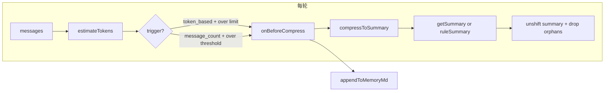

# Phase 13 实现计划：自动上下文压缩（完备）

## 目标

在现有「按消息条数 + 规则摘要」的 session 压缩基础上，做到**完备**：按 token 估算触发压缩、可选 LLM 摘要、与 Memory 结合（压缩前将关键信息写入 MEMORY.md），并保持 API 与护栏行为稳定。符合 [09-cli-advanced-roadmap.md](docs/ai/09-cli-advanced-roadmap.md) § Phase 13 与 [phase-implementation-sop.md](docs/ai/phase-implementation-sop.md)。

## 现状与变更点

| 模块                                                                     | 现状                                               | Phase 13 变更                                                                                |
| ---------------------------------------------------------------------- | ------------------------------------------------ | ------------------------------------------------------------------------------------------ |
| [packages/cli/src/agent/policy.ts](packages/cli/src/agent/policy.ts)   | `summaryThreshold`, `summaryKeepRecent`          | 新增 `contextMaxTokens?`, `compressStrategy?`, `useLlmSummary?`, `compressWriteMemory?`      |
| [packages/cli/src/agent/session.ts](packages/cli/src/agent/session.ts) | `compressToSummary(threshold, keepRecent)` 仅规则摘要 | 支持可选 `getSummary?(removed)` 异步回调，失败时回退规则摘要；方法改为 async                                      |
| [packages/cli/src/agent/loop.ts](packages/cli/src/agent/loop.ts)       | 每轮按条数调用 `compressToSummary`                      | 引入 token 估算；按 strategy 决定触发（条数 vs token）；压缩前可写 Memory、可调 LLM 摘要；diagnostics 增加 token 与压缩事件 |
| Token 估算                                                               | 无                                                | 新模块：轻量估算（如 4 字符≈1 token），每轮写入 diagnostics/verbose                                          |
| 配置/CLI                                                                 | policy 仅合并 summaryThreshold/KeepRecent           | 合并新 policy 字段；可选 CLI 覆盖                                                                    |

## 实现要点

### 1. Token 估算

- **位置**：新增 `packages/cli/src/agent/token-estimate.ts`。
- **接口**：`estimateTokens(messages: ConversationMessage[]): number`，采用保守近似（例如 4 字符 ≈ 1 token，或对 CJK 约 2 字符/token），仅统计文本与 block 内容，不依赖 tiktoken。
- **调用**：在 [loop.ts](packages/cli/src/agent/loop.ts) 每轮在构建发给 LLM 的 `messages` 之后调用，结果写入当轮 diagnostic 与 `--verbose` 日志（如 `[verbose] turn N estimated tokens: X`）。

### 2. Policy 与配置

- **Policy**（[policy.ts](packages/cli/src/agent/policy.ts)）：增加字段  
`contextMaxTokens?: number`（默认 0 表示不按 token 触发）、  
`compressStrategy?: "message_count" | "token_based"`（默认 `"message_count"`）、  
`useLlmSummary?: boolean`（默认 false）、  
`compressWriteMemory?: boolean`（默认 false）。
- **配置**（[config.ts](packages/cli/src/config.ts)）：在 `readConfigFile` 的 policy 合并处解析并写入上述字段；`ConfigFile.policy` 与 `ResolvedConfig.policy` 已为 `LoopPolicy`，类型扩展即可。
- **CLI**（[index.ts](packages/cli/src/index.ts)）：可选增加 `--context-max-tokens`、`--compress-strategy`、`--use-llm-summary`、`--compress-write-memory` 等覆盖（与 roadmap 一致即可，可先仅配置项后补 CLI）。

### 3. 触发策略（loop）

- 在 [loop.ts](packages/cli/src/agent/loop.ts) 每轮：
  - 先取 `baseMessages`、合并 memory 得到 `messages`，调用 `estimateTokens(messages)` 得到 `estimatedTokens`。
  - **是否触发压缩**：  
    - `compressStrategy === "token_based"` 且 `contextMaxTokens > 0` 且 `estimatedTokens > contextMaxTokens` → 触发；  
    - 否则沿用现有逻辑：`messages.length > summaryThreshold` 时触发。
  - 触发时先执行「压缩前 Memory 写入」再执行「压缩」；压缩逻辑见下。

### 4. Session 压缩扩展

- [session.ts](packages/cli/src/agent/session.ts) 中 `compressToSummary` 改为 async，签名扩展为：
  - `compressToSummary(threshold: number, keepRecent: number, options?: { getSummary?: (removed: ConversationMessage[]) => Promise<string> }): Promise<void>`
- 逻辑：若 `messages.length <= threshold` 则 return；否则 `toRemove = length - keepRecent`，`removed = splice(0, toRemove)`；  
`summary = options?.getSummary ? await options.getSummary(removed) : ruleSummary(removed)`（现有规则摘要抽成内部函数 `ruleSummary(removed)`）；然后 unshift 一条 user 消息 content=summary，再执行现有「丢弃孤儿 tool_result」逻辑。
- 这样 session 不依赖 provider；LLM 摘要由 loop 通过 `getSummary` 回调调用 provider 完成。

### 5. 可选 LLM 摘要

- 在 [loop.ts](packages/cli/src/agent/loop.ts) 中，当 `policy.useLlmSummary === true` 且需压缩时，构造 `getSummary` 回调：
  - 将 `removed` 序列化为单条 user 消息（可截断总长，如 50k 字符），请求 LLM 生成简短摘要（例如 system 或单轮 user：「将以下对话压缩为一段简短摘要，保留用户意图与关键结论」）。
  - 使用 `provider.complete([...])` 一次非流式调用，从返回的 blocks 取文本作为 summary。
  - 设置超时（如 15s）与 try/catch：超时或失败时返回 `ruleSummary(removed)`，即回退到规则摘要。
- 可选：在 policy 中增加 `llmSummaryTimeoutMs`、`llmSummaryMaxInputChars`，便于限长与降级。

### 6. 与 Memory 结合

- 压缩前若 `policy.compressWriteMemory === true`，在 loop 中先根据「即将被移除的 messages」生成规则摘要（与现有 ruleSummary 一致或略详），再写入 Auto Memory。
- 写入方式：复用现有 [auto-memory.ts](packages/cli/src/memory/auto-memory.ts) 的 `appendToMemoryMd(projectId, content, memoryPath)`。需要在 [index.ts](packages/cli/src/index.ts) 构造 RunOptions 时传入回调，例如 `onBeforeCompress?: (removed: ConversationMessage[], ruleSummary: string) => Promise<void>`，在 loop 触发压缩时先 `await onBeforeCompress(removed, ruleSummary(removed))` 再调用 `session.compressToSummary(...)`。
- index 中：当 `resolved.policy.compressWriteMemory === true` 且 Auto Memory 可用时，设置 `onBeforeCompress` 为 `async (removed, summary) => { await appendToMemoryMd(projectId,` [Context compression ${date}]: ${summary}`, memoryPath); }`（需从当前环境取 projectId、memoryPath，与现有 getAutoMemoryFragment 一致）。

### 7. 可观测性

- **TurnDiagnostic**（[loop.ts](packages/cli/src/agent/loop.ts)）：增加可选 `estimatedTokens?: number`；压缩发生时可在当轮或单独结构中记录 `compressStrategyUsed: "rule" | "llm"`、`memoryWritten: boolean`。
- **LoopResult**：增加可选 `contextCompressEvents?: { atTurn: number; estimatedTokens: number; strategy: "rule" | "llm"; memoryWritten: boolean }[]`，每次压缩推入一条。
- **Transcript**（[logger.ts](packages/cli/src/infra/logger.ts)）：`TranscriptPayload` 增加可选 `contextCompressEvents`；`result.diagnostics` 中每项可带 `estimatedTokens`（若已有 TurnDiagnostic 扩展则自然带上）。
- **verbose**：每轮 stderr 输出 `[verbose] turn N estimated tokens: X`；当轮若发生压缩则输出 `[verbose] context compressed at turn N, strategy=rule|llm, memoryWritten=true|false`。

## 数据流（简要）

## 文件变更清单

| 文件                                         | 变更                                                                                                     |
| ------------------------------------------ | ------------------------------------------------------------------------------------------------------ |
| `packages/cli/src/agent/token-estimate.ts` | **新增**：`estimateTokens(messages)`                                                                      |
| `packages/cli/src/agent/policy.ts`         | 增加 `contextMaxTokens`, `compressStrategy`, `useLlmSummary`, `compressWriteMemory` 及默认值                 |
| `packages/cli/src/agent/session.ts`        | `compressToSummary` 改为 async，支持 `getSummary` 回调；抽出 `ruleSummary(removed)`                              |
| `packages/cli/src/agent/loop.ts`           | 每轮 token 估算；按 strategy 触发；`onBeforeCompress`；`getSummary` 回调与超时/降级；diagnostics + contextCompressEvents |
| `packages/cli/src/config.ts`               | 解析并合并 policy 新字段                                                                                       |
| `packages/cli/src/index.ts`                | 传入 `onBeforeCompress`（当 compressWriteMemory）、`getSummary`（当 useLlmSummary）；可选 CLI 参数                   |
| `packages/cli/src/infra/logger.ts`         | `TranscriptPayload` 与 transcript 写入处支持 `contextCompressEvents`；TurnDiagnostic 类型可在此或 loop 中扩展          |
| `docs/ai/plan-phase-13.md`                 | **新增**：本方案文档（可引用 roadmap § Phase 13）                                                                   |
| `docs/ai/13-phase13-runbook.md`            | **新增**：运行方式、验证步骤、DoD 清单                                                                                |

## 验收标准（DoD）

- 当消息条数或估算 token 超过阈值时，自动触发压缩，对话可继续且不出现 2013 等协议错误。
- 若开启 LLM 摘要，压缩后上下文明显变短且语义可被模型延续；若 LLM 摘要失败或超时，自动回退到规则摘要。
- 若开启 compressWriteMemory，压缩前将规则摘要写入当前项目 Auto Memory（MEMORY.md），下次会话可通过现有 Memory 注入看到。
- `--verbose` 或 transcript 中可见 token 估算与压缩触发记录（estimatedTokens、strategy、memoryWritten）。
- `pnpm -r build`、`pnpm -r typecheck` 通过；未配置新项时行为与当前一致（仅 message_count + 规则摘要）；既有 Phase 典型命令无回归。

## 与 SOP 的对应

- **Plan**：本文档即 `docs/ai/plan-phase-13.md`，含目标、实现要点、DoD。
- **Code**：先类型/Policy，再 token 估算与 session 扩展，再 loop 与 index 集成，最后 logger/transcript。
- **Runbook**：`docs/ai/13-phase13-runbook.md`，含核心原理、运行方式、成功/异常路径验证、DoD 清单。
- **DoD**：按上述验收标准与 Runbook 逐条可执行检查。

