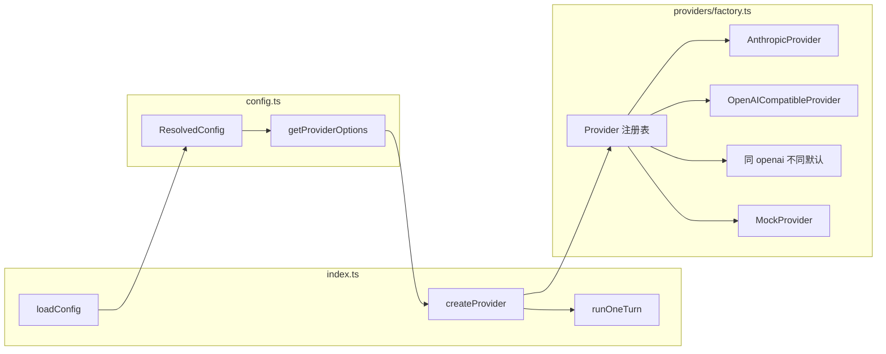

# Phase 7：多 Provider 与韧性 + DeepSeek 实现计划

## 目标

- 支持多 LLM 后端（minimax、openai、deepseek、mock），具备可扩展的 Provider 注册与工厂创建。
- 新增 **DeepSeek** 支持（OpenAI API 格式兼容）。
- 可选：主 Provider 不可用（429/5xx）时配置 fallback 或明确报错提示。

---

## 现状与变更点

| 现状                                                                                                                    | 变更后                                                                                    |
| --------------------------------------------------------------------------------------------------------------------- | -------------------------------------------------------------------------------------- |
| [packages/cli/src/index.ts](packages/cli/src/index.ts) 内硬编码 `if (mock) ... else getMinimaxConfig + AnthropicProvider` | 通过 **Provider 工厂** 按 `resolved.provider` 创建实例，新增 provider 只改工厂与配置                      |
| 仅 minimax（Anthropic 兼容）+ mock                                                                                         | 保留 minimax/mock，新增 **OpenAI 兼容** 实现，供 `openai` 与 `deepseek` 共用                         |
| [packages/cli/src/config.ts](packages/cli/src/config.ts) 仅 `getMinimaxConfig()`，默认 DEFAULT_BASE_URL 等为 MiniMax        | 抽象「按 provider 名取配置」：各 provider 的 apiKey/baseURL/model 从 env + ResolvedConfig 解析，工厂统一调用 |

---

## 架构与数据流

- **工厂**：根据 `resolved.provider`（如 `minimax` | `openai` | `deepseek` | `mock`）选择实现类，并传入从 `getProviderOptions(providerName, resolved)` 得到的 options（含 apiKey、baseURL、model 等）。
- **OpenAI 兼容**：同一套 `OpenAICompatibleProvider`，`openai` 与 `deepseek` 仅默认 baseURL 和 env key 不同（见下）。

---

## 实现要点

### 1. Provider 抽象与工厂（可扩展）

- **保持** [packages/cli/src/providers/base.ts](packages/cli/src/providers/base.ts) 的 `ChatProvider` 接口不变（`name`, `complete`, `streamComplete?`）。
- **新增** `packages/cli/src/providers/factory.ts`：
  - 定义 `ProviderId = "minimax" | "openai" | "deepseek" | "mock"`。
  - 导出 `createProvider(providerId: ProviderId, resolved: ResolvedConfig, tools: ToolSpec[]): ChatProvider`。
  - 内部根据 `providerId` 调用对应的 config 获取函数并实例化：
    - `mock` → `new MockProvider()`（无需 config）。
    - `minimax` → `getMinimaxConfig(resolved)` → `new AnthropicProvider({ ...cfg, tools, maxRetries, retryDelayMs })`。
    - `openai` → `getOpenAICompatibleConfig("openai", resolved)` → `new OpenAICompatibleProvider(options)`。
    - `deepseek` → `getOpenAICompatibleConfig("deepseek", resolved)` → `new OpenAICompatibleProvider(options)`。
- **入口** [packages/cli/src/index.ts](packages/cli/src/index.ts)：删除对 `getMinimaxConfig`、`AnthropicProvider` 的直接引用；改为 `createProvider(resolved.provider as ProviderId, resolved, registry.list().map(...))`，并在 provider 创建失败时统一报错（含「检查对应 env 与配置」类提示）。更新 `--provider` 选项描述为 `minimax | openai | deepseek | mock`。

### 2. 配置层：按 Provider 取 Options

- 在 [packages/cli/src/config.ts](packages/cli/src/config.ts) 中：
  - **保留** `getMinimaxConfig(resolved)`，供 minimax 使用。
  - **新增** `getOpenAICompatibleConfig(providerId: "openai" | "deepseek", resolved: ResolvedConfig): OpenAICompatibleConfig`：
    - `openai`：apiKey 来自 `process.env.OPENAI_API_KEY`，baseURL 默认 `https://api.openai.com`，model 用 `resolved.model` 或 env `OPENAI_MODEL` 或默认 `gpt-4o-mini`（可定）。
    - `deepseek`：apiKey 来自 `process.env.DEEPSEEK_API_KEY`，baseURL 默认 `https://api.deepseek.com`，model 用 `resolved.model` 或 env `DEEPSEEK_MODEL` 或默认 `deepseek-chat`。
    - baseURL/model 合并顺序：默认 → 配置文件 → 环境变量 → 已有 ResolvedConfig 的 model/baseURL（若当前设计是全局的，则 openai/deepseek 共用 resolved.model/baseURL 时，以 getOpenAICompatibleConfig 内 env 覆盖为准）。
  - 可选：若希望 fallback，在 `ConfigFile`/`ResolvedConfig` 中增加 `providerFallback?: string[]` 的解析（如 `["deepseek", "openai"]`），并在工厂或上层使用。
- 不在 config 中写死「只有 minimax 用 baseURL」：minimax 仍用 `getMinimaxConfig`；openai/deepseek 用 `getOpenAICompatibleConfig`，不依赖 `resolved.baseURL` 的默认值（可保留 resolved.baseURL 给 minimax 或未来统一覆盖）。

### 3. OpenAI 兼容 Provider 与 DeepSeek

- **新增** `packages/cli/src/providers/openai-compatible.ts`（或 `openai.ts`）：
  - 实现 `ChatProvider`，内部使用 **fetch** 调用 `POST {baseURL}/v1/chat/completions`（不引入 `openai` SDK 以减依赖；若团队希望用官方 SDK，可改为 `import OpenAI` 并传 `baseURL`）。
  - **请求**：
    - 将 `ConversationMessage[]` 与 system prompt 转换为 OpenAI 格式：`system` 一条；`user`/`assistant`/`tool` 消息；assistant 的 `tool_use` 转为 `tool_calls`；user 中的 `tool_result` 转为 `role: "tool"`。
    - 支持 `tools` 参数：格式与 [OpenAI tool schema](https://platform.openai.com/docs/api-reference/chat/create#chat-create-tools) 一致（name, description, parameters 为 JSON Schema）；从现有 `AnthropicToolSpec` 或 registry 的 `input_schema` 映射为 `parameters`。
    - `model`、`max_tokens`（如 4096）、`stream: false`（先做非流式，流式可选后续）。
  - **响应**：
    - 解析 `choices[0].message.content` 与 `choices[0].message.tool_calls`，转换为 `AssistantContentBlock[]`（text + tool_use；OpenAI 无 thinking，可不生成或忽略）。
  - 使用现有 [packages/cli/src/infra/retry.ts](packages/cli/src/infra/retry.ts) 的 `retryWithBackoff`，与 Anthropic 一致（429/5xx 可重试）。
- **DeepSeek**：与 OpenAI 同格式，仅通过 `getOpenAICompatibleConfig("deepseek", resolved)` 注入不同 baseURL/apiKey/model 默认值，不另写一类。

### 4. 错误与降级（可选）

- 当主 Provider 在重试后仍抛 429/5xx 或网络错误时：
  - **方案 A**：仅在 stderr 报错并提示检查配置/网络，退出码 1 或 2（与现有 EXIT_CONFIG/EXIT_BUSINESS 约定一致）。
  - **方案 B**：若配置了 `providerFallback`，则按顺序用 fallback 列表中的 provider 再创建并重试一次请求（可在工厂层封装一个 `FallbackProvider` 或仅在 index 的 runOneTurn 外 catch 后换 provider 重试一次）。建议先做方案 A，DoD 通过后再在 Runbook 中说明可选 fallback 的扩展方式。

### 5. 文档与 SOP

- **Plan**：在 [docs/ai/04-code-agent-commercial-plan.md](docs/ai/04-code-agent-commercial-plan.md) 的 Phase 7 节已有目标与要点；可新增 `docs/ai/plan-phase-7.md` 记录本实现的「现状分析、文件清单、DoD」。
- **Runbook**：新增 `docs/ai/07-phase7-runbook.md`，按 [phase-implementation-sop.md](docs/ai/phase-implementation-sop.md) 5.2：核心原理（Provider 工厂、OpenAI 兼容、各 provider 的 env）、运行方式（示例命令：`--provider openai`、`--provider deepseek`）、环境变量表（OPENAI_API_KEY、DEEPSEEK_API_KEY、可选 OPENAI_MODEL/DEEPSEEK_MODEL/baseURL）、成功/异常路径验证、DoD。
- **SOP 索引**：更新 [docs/ai/phase-implementation-sop.md](docs/ai/phase-implementation-sop.md) 末尾 Phase 索引，增加 Phase 7 的方案位置与 Runbook 链接。

---

## 文件变更清单

| 文件                                                                         | 变更                                                                 |
| -------------------------------------------------------------------------- | ------------------------------------------------------------------ |
| [packages/cli/src/providers/base.ts](packages/cli/src/providers/base.ts)   | 可选：补充注释或类型别名，接口不变                                                  |
| **新增** `packages/cli/src/providers/openai-compatible.ts`                   | OpenAI 兼容 Provider：message/tool 转换、fetch `/v1/chat/completions`、重试 |
| **新增** `packages/cli/src/providers/factory.ts`                             | ProviderId 类型、createProvider(providerId, resolved, tools)          |
| [packages/cli/src/config.ts](packages/cli/src/config.ts)                   | 新增 getOpenAICompatibleConfig("openai"                              |
| [packages/cli/src/index.ts](packages/cli/src/index.ts)                     | 使用 createProvider；更新 --provider 说明；统一 provider 创建错误提示              |
| **新增** `docs/ai/plan-phase-7.md`                                           | 本 Phase 的详细方案与 DoD（可选，若 04 中已足够则略）                                 |
| **新增** `docs/ai/07-phase7-runbook.md`                                      | 运行方式、环境变量、验证步骤、DoD                                                 |
| [docs/ai/phase-implementation-sop.md](docs/ai/phase-implementation-sop.md) | 索引增加 Phase 7                                                       |

---

## 验收标准（DoD）

- 通过配置或 CLI 切换 `--provider minimax | openai | deepseek | mock` 可完成对话与工具调用。
- `--provider deepseek` 且设置 `DEEPSEEK_API_KEY` 与可选 `DEEPSEEK_MODEL`/baseURL 时，能正常调用 DeepSeek API（OpenAI 格式）。
- `--provider openai` 且设置 `OPENAI_API_KEY` 时，能正常调用 OpenAI 或任意 baseURL 的 OpenAI 兼容 API。
- 文档（Runbook）中说明各 Provider 所需环境变量与配置项（含 DeepSeek）。
- `pnpm -r build`、`pnpm -r typecheck` 通过；既有 Phase 的典型命令（如 `--provider mock`）无回归。

---

## 实现顺序建议

1. **类型与配置**：ProviderId、OpenAICompatibleConfig、getOpenAICompatibleConfig。
2. **OpenAI 兼容 Provider**：openai-compatible.ts（message/tool 转换 + fetch + 重试）。
3. **工厂**：factory.ts 中注册 minimax、openai、deepseek、mock，并实现 createProvider。
4. **入口**：index.ts 改为 createProvider，更新帮助与错误提示。
5. **Runbook 与索引**：07-phase7-runbook.md、SOP 索引更新。
6. **可选**：providerFallback 配置与简单 fallback 逻辑（可放在 DoD 通过之后）。

