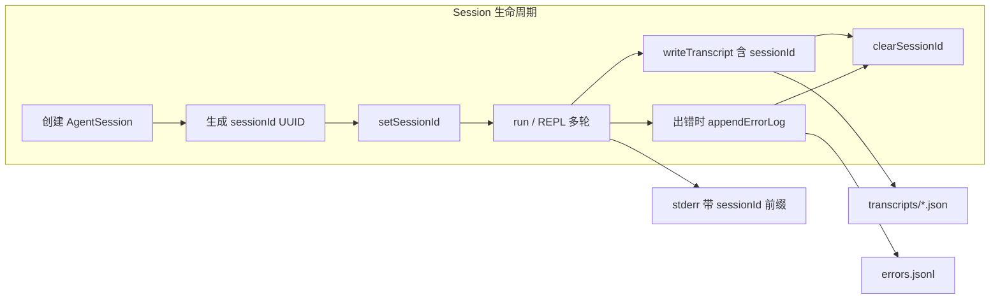

# Session UUID 与独立 Error 日志 — 方案评估与实现计划

## 方案评估结论：**合理，建议采纳**

从 Agent 工程视角看，你的设计优于当前实现，主要三点：

1. **Session 作为关联边界**
  当前是「每次 run 一个 runId」：单次 prompt 没问题，但 REPL 下每轮都换 ID，无法用**一个 ID** 把整次对话的日志串起来。  
   改为「一次 session 一个 UUID」后：单次 prompt = 1 session = 1 UUID；REPL = 1 session 多轮 = 同一 UUID，便于用 `grep sessionId` 查整段交互。
2. **标准 UUID**
  使用标准 UUID（如 Node `crypto.randomUUID()`）比当前 `timestamp(36)-random` 更通用、易与外部系统（监控、日志平台）对接。
3. **Transcript 与 Error 分离**
  - **Transcript**：对话状态快照（messages、result、approvalLog），用于复盘/重放。  
  - **Error 独立日志**：仅记录失败事件（sessionId、时间、错误类型/信息、可选 transcript 路径），便于运维/监控单独 tail、按 sessionId 查错，而不用翻每条 transcript。  
   职责清晰，也利于后续接告警或日志聚合。

**建议**：实现时保留「transcript 内 meta.error」作为该次 run 的上下文快照，同时**额外**写入独立 error 日志，二者互补（transcript 看单次状态，error 日志看全局失败列表）。

---

## 数据流（概念）

- **Transcript**：按现有逻辑写 JSON 到 `transcriptDir`，payload 中把 `runId` 改为 `sessionId`，可选在 REPL 场景增加 `runIndex` 区分同一 session 内多次写入。
- **Error 日志**：仅在有错误时追加写入，与 transcript 解耦；通过 `sessionId` 与 transcript/stderr 关联。

---

## 实现计划

### 1. Session 创建时生成并绑定 UUID

- **位置**：[packages/cli/src/index.ts](packages/cli/src/index.ts)  
- 在 `const session = new AgentSession()` 之后立即：
  - 生成 `sessionId = crypto.randomUUID()`（或调用 logger 提供的 `createSessionId()`）。
  - 调用 `setSessionId(sessionId)`，使后续 stderr 日志统一带 `[sessionId]` 前缀。
- **单次 prompt**：该 run 全程使用该 sessionId，在 `finally` 中 `clearSessionId()`。
- **REPL**：整个 for 循环共用同一 sessionId，不再在每轮里生成 runId；在 REPL 循环结束后（写最终 transcript 之后）调用 `clearSessionId()`。

### 2. Logger：runId → sessionId

- **位置**：[packages/cli/src/infra/logger.ts](packages/cli/src/infra/logger.ts)  
- 将「run 级」改为「session 级」：
  - 新增 `createSessionId(): string`，实现为 `crypto.randomUUID()`（需从 `node:crypto` 引入）。
  - 将 `currentRunId` / `setRunId` / `clearRunId` 重命名为 `currentSessionId` / `setSessionId` / `clearSessionId`；`logPrefix()` 使用 `currentSessionId`。
  - 移除或弃用 `createRunId`（若仍有调用处则改为使用 `createSessionId`）。
- 所有 `logToolCall`、`logStreamTurn`、`logTurnDiagnostics` 保持通过 `logPrefix()` 输出前缀，行为不变，仅前缀含义从 runId 改为 sessionId。

### 3. Transcript 使用 sessionId

- **位置**：[packages/cli/src/infra/logger.ts](packages/cli/src/infra/logger.ts)  
- `TranscriptPayload`：字段 `runId` 改为 `sessionId`（必填，string）。
- `writeTranscript` 的调用方（index.ts）改为传入 `sessionId`；单次 prompt 与 REPL 均使用上面在 session 创建时生成的 `sessionId`。
- 可选：在 REPL 多次写 transcript 时增加 `runIndex?: number`，便于区分同一 session 内第几次写入；若当前不写「每轮 transcript」可暂不实现。

### 4. 独立 Error 日志

- **位置**：[packages/cli/src/infra/logger.ts](packages/cli/src/infra/logger.ts)  
- 新增接口与实现：
  - 定义 `ErrorLogEntry`: `{ sessionId: string; timestamp: string; name: string; message: string; transcriptPath?: string }`。
  - 新增 `appendErrorLog(dir: string, entry: ErrorLogEntry): Promise<void>`：
    - 目标文件：`<transcriptDir>/errors.jsonl`（JSON Lines，一行一条 JSON）。
    - 使用 `appendFile` 追加一行 `JSON.stringify(entry) + "\n"`；写入前 `mkdir(dir, { recursive: true })`。
    - 对 `message` 可做与 stderr 一致的脱敏（如 `redactForLog`），避免密钥写入磁盘。
- **调用时机**：在 [index.ts](packages/cli/src/index.ts) 中，每次捕获 `LoopLimitError` / `LoopSpinDetectedError` 并写入 transcript 之后，调用 `appendErrorLog(resolved.transcriptDir, { sessionId, timestamp: new Date().toISOString(), name: err.name, message: err.message, transcriptPath })`。  
- Transcript 的 `meta.error` 保留不动，继续作为该次 run 的上下文；独立 error 日志仅做「独立记录」，与 transcript 解耦。

### 5. Index 改动汇总

- **单次 prompt 分支**  
  - 在创建 `session` 后生成 `sessionId = createSessionId()` 并 `setSessionId(sessionId)`。  
  - 删除该分支内的 `runId` 生成与 `setRunId`/`clearRunId`；所有 `writeTranscript` 使用 `sessionId`；成功/错误时的终端输出改为 `sessionId=xxx`。  
  - 在 catch 中写 transcript 后调用 `appendErrorLog(..., { sessionId, timestamp, name: err.name, message: err.message, transcriptPath })`。  
  - 在 `finally` 中 `clearSessionId()`。
- **REPL 分支**  
  - 在进入 for 循环前（创建 session 之后）生成一次 `sessionId` 并 `setSessionId(sessionId)`。  
  - 循环内不再生成 runId，不再 `setRunId`/`clearRunId`；每轮日志自然带同一 sessionId 前缀。  
  - 成功轮次输出使用 `sessionId=xxx`（可保留 turns/toolCalls 等）。  
  - 错误时：写 transcript（带 sessionId）+ `appendErrorLog`，再 `process.stderr.write(..., sessionId, transcriptPath)`。  
  - 循环结束后写最终 transcript（带 sessionId），输出 `sessionId=xxx transcript=...`，然后 `clearSessionId()`。

### 6. 文档与 Runbook

- 更新 [docs/ai/04-phase4-runbook.md](docs/ai/04-phase4-runbook.md)：  
  - 「日志系统与 runId」改为「日志系统与 sessionId」：说明 session 创建时生成 UUID、stderr 前缀、结束输出中的 `sessionId=`。  
  - 「Transcript 变更」：payload 使用 `sessionId`；新增「Error 独立日志」小节：`errors.jsonl` 路径、格式、与 sessionId 的关联、仅错误时追加。
- 更新 [docs/ai/06-phase6-runbook.md](docs/ai/06-phase6-runbook.md)：安全/审计与验收中提及 sessionId 与独立 error 日志。
- 可选：在 [docs/issues/004-logging-runId-and-error-in-transcript.md](docs/issues/004-logging-runId-and-error-in-transcript.md) 中追加「演进：sessionId + 独立 error 日志」或新开 005 记录本次设计。

---

## 验收要点

- 单次 prompt：从创建 session 到结束，stderr 所有相关行带同一 `[sessionId]` 前缀；transcript JSON 含 `sessionId`（无 runId）；出错时 `transcriptDir/errors.jsonl` 新增一行且含该 sessionId 与 transcriptPath。
- REPL：多轮对话全程同一 sessionId；任意一轮出错都会在 `errors.jsonl` 中追加一条并带同一 sessionId；最终 transcript 也含该 sessionId。
- 可用 `grep <sessionId> errors.jsonl` 和 `grep <sessionId> transcript*.json` 关联某次 session 的全部错误与 transcript。

