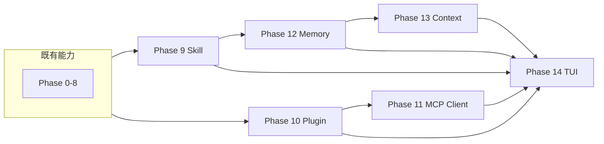

# CLI 进阶能力 Roadmap（Phase 9–14）

在 [04-code-agent-commercial-plan.md](04-code-agent-commercial-plan.md) 与 [00-initialization-plan.md](00-initialization-plan.md) 已完成的 Phase 0–8 基础上，本路线图覆盖 Skill 加载、MCP 客户端、Plugin、Memory（会话+持久化）、完备上下文压缩与 Ink TUI，并按 [phase-implementation-sop.md](phase-implementation-sop.md) 拆分为可执行、可验收的 Phase。实施顺序已按依赖关系排列。

---

## 目标与原则

| 项目 | 说明 |
|------|------|
| **Skill** | CLI 加载外部 Skill（如 SKILL.md/规则文件），用于增强系统提示词或工具行为（仅「加载」侧，不对外暴露为 Skill） |
| **MCP** | CLI 作为 MCP **客户端**：发现并调用外部 MCP 服务器的 tools/resources，注入到 Agent Loop |
| **Plugin** | Claude Code 式插件（目录 + `.claude-plugin/plugin.json` manifest），内含声明式 `skills/`、`agents/`、`hooks/`、MCP/LSP 配置等；通过 `--plugin-dir` 或配置加载，插件内 Skills 以 `plugin-name:skill-name` 命名空间并入现有 Skill 管线 |
| **Memory** | 会话内记忆（已有）+ **跨会话持久化**（项目/用户级），可注入上下文 |
| **上下文压缩** | 在现有「按条数 + 规则摘要」基础上，做到 **完备**：token 估算、按 token 触发、可选 LLM 摘要、与 Memory 结合 |
| **UI** | 引入 **TUI**（如 Ink）：交互式命令中展示当前模型、上下文、状态栏、历史区等 |

每阶段仍按 **Plan → Code → Runbook → DoD** 执行，并与现有 `packages/cli` 结构、配置、transcript 兼容。

---

## 阶段总览与依赖

- **Phase 9（Skill）**、**Phase 10（Plugin）** 可并行或先后做，建议先 9 再 10（Skill 更轻量，Plugin 可复用部分加载/发现逻辑）。
- **Phase 11（MCP 客户端）** 依赖 Plugin 或独立「工具注入」抽象，建议在 Plugin 之后。
- **Phase 12（Memory）** 可为 Skill/系统提示提供「注入记忆」的占位，与 Phase 9 无强依赖，但先做 9 便于在 system prompt 里预留 memory 占位。
- **Phase 13（上下文压缩）** 依赖 Memory 与现有 session 压缩，放在 Memory 之后。
- **Phase 14（TUI）** 最后做，以便展示模型、上下文、token、Memory 状态等全部信息。

---

## Phase 9：Skill 加载机制

**目标**：从本地路径或配置指定路径加载 Skill 定义（如 SKILL.md 或约定 JSON/YAML），将其内容合并进系统提示词或影响工具行为，且不破坏现有可观测性。

**实现要点**：

1. **Skill 来源与格式**
   - 支持从配置项（如 `skillPaths: string[]`）或 CLI `--skill <path>` 指定文件/目录。
   - 约定至少支持：单文件 `SKILL.md`（Markdown 描述 + 可选 frontmatter）、或结构化 `skill.json`（如 `{ "description", "systemPromptAddition", "triggers" }`）。
   - 若为目录，则扫描并合并其下所有约定 Skill 文件。

2. **与 system prompt 集成**
   - 在 system 构建处增加「Skill 片段」注入：将 Skill 的 `description` / `systemPromptAddition` 拼接到现有 system prompt，并保留「来源」标记便于 transcript 可追溯。

3. **配置与 CLI**
   - 在配置的 `ConfigFile` / `ResolvedConfig` 中增加 `skillPaths?: string[]`；CLI 支持 `--skill <path>` 可多次使用，覆盖或追加配置中的路径。
   - 合并顺序：默认（无）→ 配置文件 → CLI `--skill`。

4. **可观测性**
   - `--verbose` 或 transcript 中记录本次 run 加载的 Skill 路径与摘要（如文件名、字符数），便于审计。

**验收（DoD）**：

- 指定 `--skill <path>` 或配置 `skillPaths` 后，system prompt 中可见对应 Skill 内容，且 transcript 能体现加载了哪些 Skill。
- 无 `--skill` 且配置无 `skillPaths` 时行为与当前一致。

---

## Phase 10：Plugin 机制

**目标**：支持 Claude Code 风格的插件：以目录为单位，包含 manifest（`.claude-plugin/plugin.json`）及可选的 `skills/`、`agents/`、`hooks/` 等声明式内容；通过 `--plugin-dir` 或配置加载，将插件提供的 Skills 以命名空间形式并入现有 Skill 加载与 system prompt 构建，与 Phase 9 行为一致且可追溯来源。

**实现要点**：

1. **Manifest 与插件契约**
   - 约定插件根目录下存在 `.claude-plugin/plugin.json`（或允许仅包含 `skills/` 的轻量插件，manifest 可选）。
   - Manifest 字段：`name`（必填，用作命名空间）、`description`、`version`、`author` 等；与 [Claude Code 文档](https://code.claude.com/docs/en/plugins) 对齐。
   - 仅解析 JSON，不执行插件内自定义 JS/TS 代码。

2. **插件发现与加载方式**
   - 配置项增加 `pluginDirs?: string[]`（路径列表）；CLI 增加 `--plugin-dir <path>`，可多次使用，与配置合并（例如：配置先，CLI 追加）。
   - 启动时按顺序解析每个插件目录：若存在 `.claude-plugin/plugin.json` 则读取并校验 `name`；若不存在 manifest 但存在 `skills/`，可视为匿名插件或跳过（由实现决定）。

3. **Skills 集成（与 Phase 9 统一）**
   - 对每个已识别插件，扫描其根下 `skills/` 子目录，每个子目录内若有 `SKILL.md`（或约定 `skill.json`），则加载为一条 Skill；来源标记或 skill id 使用 `plugin-name:子目录名`（与 Claude Code 命名空间一致）。
   - 将上述 Skill 条目与现有 `loadSkills` / 全局 Skill 结果合并，统一进入 `buildSystemPrompt`，并在 transcript/verbose 中记录来源为插件及插件名。

4. **可选：Hooks / Agents / Settings**
   - 若 Phase 10 包含 hooks：在插件根下读取 `hooks/hooks.json`，与现有（或新增）全局 hooks 配置合并，并在 Agent Loop 适当位置触发；格式与 Claude Code 文档一致。
   - `agents/`、`settings.json`、`.mcp.json` 可在 Phase 10 仅做结构约定与文档说明，实际解析与使用留到 Phase 11（MCP）或后续 TUI/Agent 阶段。

5. **可观测性与安全**
   - transcript 或 `--verbose` 中列出本次 run 加载的插件路径及 manifest name；文档注明插件以与 CLI 相同权限运行，用户应只加载可信插件。

**验收（DoD）**：

- 给定一个符合上述约定的插件目录（含 `.claude-plugin/plugin.json` 与 `skills/hello/SKILL.md`），通过 `--plugin-dir ./that-plugin` 或配置 `pluginDirs` 加载后，system prompt 中可见该插件提供的 Skill 内容，且来源标记为 `plugin-name:hello`（或等价形式）；transcript/verbose 可体现已加载插件列表。
- 不指定任何插件时，行为与当前一致；与 Phase 9 的 `--skill` / `skillPaths` 并存时，插件 Skills 与直接指定 Skills 一并合并，无冲突。

---

## Phase 11：MCP 客户端

**目标**：CLI 作为 MCP **客户端**，能够连接到一个或多个 MCP 服务器（如 stdio/SSE 传输），获取其暴露的 tools 与 resources，并将这些 tools 注入到当前 Agent Loop，使模型可调用「来自 MCP 的能力」。

**实现要点**：

1. **MCP 客户端依赖与抽象**
   - 引入 MCP 客户端实现（如 `@modelcontextprotocol/sdk` 或自研最小实现）：建立与 MCP server 的传输（至少支持 stdio，可选 SSE），按 MCP 协议拉取 `tools/list`、`tools/call`，以及可选 `resources/read` 的列表与内容。
   - 在 `packages/cli` 内增加一层薄封装：将 MCP 的 tool 描述转换为现有 Tool 形态，并在调用时转发到 MCP `tools/call`，将结果映射为 `tool_result`。

2. **配置与发现**
   - 配置项：如 `mcpServers: { [name]: { command, args?, env? } }`（stdio）或 `url`（SSE）。CLI 可选 `--mcp <name>` 指定使用哪些已配置的 server。
   - 启动时按配置连接 MCP server(s)，拉取 tools 列表并注册到 ToolRegistry（可加前缀如 `mcp_<server>_<tool>` 避免与内置/插件工具重名）。

3. **与 Loop 集成**
   - 在 Agent Loop 中，工具执行分支对「MCP 来源」工具走 MCP client 的 `tools/call`，超时与错误格式与现有工具一致（如 `tool_result` 含 `is_error`），并遵守现有批准流（若工具标记需批准）。

4. **可观测性**
   - transcript 与 `--verbose` 中能区分工具来源（内置 / 插件 / MCP），MCP 调用记录 server 名与 tool 名。

**验收（DoD）**：

- 配置一个本地 MCP server（如用 stdio 启动的示例 server），CLI 能列出其 tools 并在一次对话中成功调用至少一个 MCP tool，结果正确回填到 session。
- 未配置或未指定 MCP 时行为与当前一致。

---

## Phase 12：Memory（会话内 + 跨会话持久化）

**目标**：在现有会话内消息历史基础上，增加「跨会话持久化记忆」：项目级或用户级存储，支持写入与读取，并在构建 system prompt 或上下文时注入相关记忆，便于长周期任务与个性化。

**实现要点**：

1. **记忆存储与格式**
   - **存储**：本地文件存储即可（如项目下 `.mini-agent/memory.json` 或用户目录下 `~/.mini-agent/memory.json`），按「项目」与「用户」区分 scope；格式可为 JSON 数组或键值，包含：key、value、scope、updatedAt 等。
   - **读写接口**：在 `packages/cli` 内新增 memory 模块：`readMemory(scope)`、`writeMemory(scope, key, value)`、`listKeys(scope)`，以及可选的「最近 N 条」或「按 key 前缀查询」用于注入。

2. **与 Agent 的集成**
   - **写入**：通过工具或系统策略写入记忆。例如提供内置工具 `memory_write`（需批准）或由模型在特定条件下触发（需在 system prompt 中约定）；写入时落盘并可选追加到 transcript。
   - **读取**：在每轮构建发给 LLM 的 messages 之前，根据当前 scope（项目/用户）从 memory 读取若干条，拼成「记忆片段」注入 system prompt 或首条 user 消息（如 `[Memory]: ...`），并保证 transcript 中可追溯来源。

3. **会话内记忆**
   - 当前 session 的「会话内记忆」可沿用现有 AgentSession 的 messages；若需显式「会话内记忆」结构（如命名槽），可在本 Phase 增加轻量 in-memory 键值，仅当次 REPL 有效，不落盘。

4. **配置**
   - 配置项：`memoryScope`（project | user）、`memoryPath`（覆盖默认路径）、`memoryMaxInject`（注入条数或字符上限）。CLI 可覆盖。

**验收（DoD）**：

- 在同一项目下连续两次运行（或两次 REPL 会话），第一次通过工具或约定方式写入一条持久化记忆，第二次启动时能在 system 或首条上下文中看到该记忆并被模型使用。
- 会话内记忆（若实现）在同一 REPL 会话中可写可读；transcript 中能区分记忆来源（session vs persistent）。

---

## Phase 13：自动上下文压缩（完备）

**目标**：在现有「按消息条数 + 规则摘要」的 session 压缩基础上，做到**完备**：按 token 估算触发压缩、可选 LLM 摘要、与 Memory 结合（重要信息可先写入 Memory 再压缩），并保持 API 与护栏行为稳定。

**实现要点**：

1. **Token 估算**
   - 引入轻量 token 估算（如按字符数/单词数近似，或使用 tiktoken/provider 能力若可用）：在每轮或每次追加消息后估算当前 messages 总 token 数，写入 diagnostics 或 `--verbose`，供 TUI 展示。

2. **触发策略**
   - 在 policy 中增加 `contextMaxTokens?: number`、`compressStrategy?: "message_count" | "token_based"`。
   - 当 `compressStrategy === "token_based"` 且当前估算 token 超过 `contextMaxTokens` 时，触发压缩；否则保留现有「按条数」触发逻辑。压缩后仍调用 session 的规则摘要或扩展为「规则摘要 + 可选 LLM 摘要」。

3. **可选 LLM 摘要**
   - 若配置 `useLlmSummary: true`，在压缩时可将「待压缩的旧消息」发给 LLM 生成简短摘要（单独请求，不占用主对话），再将摘要作为一条 user 消息插入，并丢弃原消息。需限长、超时与错误降级（失败时回退到规则摘要）。

4. **与 Memory 结合**
   - 压缩前可选：将本轮或本段对话的「关键事实」通过 memory 模块写入持久化（如由另一小模型或规则抽取），再执行压缩，避免重要信息仅存在于被裁掉的消息中。

5. **可观测性**
   - transcript 与 diagnostics 中记录：触发压缩时的 token 估算值、采用的策略（规则 vs LLM）、以及是否写入了 Memory。

**验收（DoD）**：

- 当消息条数或估算 token 超过阈值时，自动触发压缩，对话仍可继续且不出现 2013 等协议错误。
- 若开启 LLM 摘要，压缩后上下文明显变短且语义可被模型延续；若 LLM 摘要失败，自动回退到规则摘要。
- `--verbose` 或 transcript 中可见 token 估算与压缩触发记录。

---

## Phase 14：完备 UI（Ink TUI）

**目标**：在交互式命令（REPL）中引入 TUI（基于 Ink），展示当前模型、上下文状态（消息条数/token 估算）、批准模式、可选 Memory 状态、历史区等，提升可观测性与操作清晰度。

**实现要点**：

1. **技术选型**
   - 使用 **Ink**（React for CLI）渲染 TUI；REPL 输入可沿用 readline 或接入 Ink 的 `<TextInput>`，需处理「流式输出」与输入框共存（如输出区可滚动、输入区固定底部）。

2. **布局与组件**
   - **状态栏**（顶部或底部）：当前 provider/model、approval 模式、当前轮次、上下文条数或 token 估算、可选「Memory: project | user」。
   - **主内容区**：历史对话与当前轮次的模型输出（流式时可追加）、工具调用与结果的精简展示。
   - **输入区**：保留「> 」式输入，支持多行与提交；可选快捷命令（如 `/model` 切换、`/memory` 查看）。

3. **与现有逻辑集成**
   - TUI 作为「REPL 的另一种前端」：当检测到 TTY 且配置或 CLI 指定 `--tui` 时进入 Ink 模式；否则保持现有纯文本 REPL。Provider、Loop、Session、Transcript 均复用，不重复实现业务逻辑。

4. **信息源**
   - 模型/provider 名从 ResolvedConfig 与 provider 获取；上下文条数/token 从 session 与 Phase 13 的 token 估算获取；Memory 状态从 Phase 12 的 memory 模块读取。

**验收（DoD）**：

- 使用 `--tui` 启动 REPL 时，出现 Ink 界面，状态栏正确显示当前模型、上下文信息与批准模式。
- 在 TUI 中完成至少一轮带工具调用的对话，流式输出与工具结果展示正常，退出后 transcript 仍正确生成。
- 未使用 `--tui` 时，现有 REPL 行为不变。

---

## 建议执行顺序与产出

| Phase | 主题 | 建议节奏 | 产出物 |
|-------|------|----------|--------|
| 9 | Skill 加载 | 1 周 | plan-phase-9.md, 09-phase9-runbook.md, DoD 检查表 |
| 10 | Plugin 机制 | 1–2 周 | plan-phase-10.md, 10-phase10-runbook.md, 示例插件 |
| 11 | MCP 客户端 | 1–2 周 | plan-phase-11.md, 11-phase11-runbook.md, 示例 MCP server 用法 |
| 12 | Memory | 1–2 周 | plan-phase-12.md, 12-phase12-runbook.md |
| 13 | 上下文压缩完备 | 1 周 | plan-phase-13.md, 13-phase13-runbook.md |
| 14 | TUI（Ink） | 1–2 周 | plan-phase-14.md, 14-phase14-runbook.md |

---

## 与现有文档的衔接

- **00-initialization-plan.md**：在「分阶段实施路线」后增加「Phase 9–14 进阶能力」小节，指向本文档。
- **04-code-agent-commercial-plan.md**：在「总结」或「建议学习顺序」后增加「后续：Phase 9+ 进阶能力」并指向本文档。
- 每个 Phase 的详细 Plan 可放在 `docs/ai/plan-phase-N.md`，Runbook 为 `docs/ai/NN-phaseN-runbook.md`（如 09、10、…、14），符合 phase-implementation-sop.md 的命名与结构要求。

---

## 风险与依赖说明

- **Ink**：需在 Node 下稳定支持 ESM 与现有 build；若遇到兼容性问题，可退化为「增强型纯文本状态行」作为 Phase 14 的 MVP，再迭代到完整 TUI。
- **MCP**：依赖官方或社区 MCP SDK 的稳定性与协议版本；建议先支持 stdio transport，SSE 可作为后续扩展。
- **Token 估算**：不同模型 tokenizer 不同，Phase 13 可采用保守近似（如 4 字符 ≈ 1 token）或仅对已对接的 provider 做估算，并在文档中说明适用范围。
